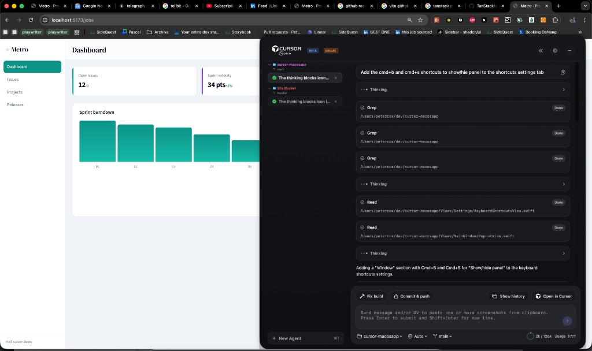
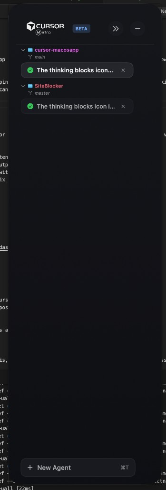
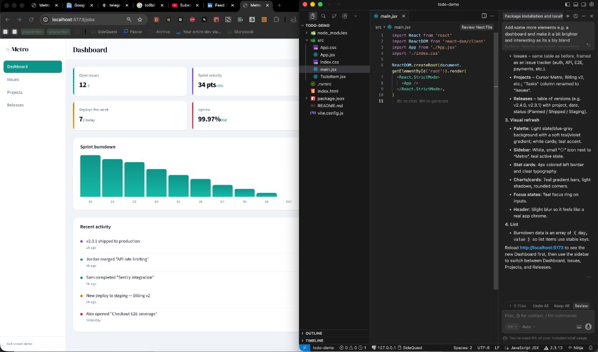

# Cursor Metro

Cursor’s AI agent in your menu bar. Code in your editor, get help without leaving the flow.

A native macOS app that talks to the Cursor Agent CLI. One floating panel, multiple projects, real-time streaming—no need to switch into the full IDE when you just want to ask the agent something.

---

## What it is

**Cursor Metro** is an unofficial, native macOS app that gives you quick access to Cursor’s AI agent from the **menu bar**. It uses the same Cursor Agent CLI that powers the IDE, so you get the same models and context—without running the full Cursor app.

Open the panel, pick a project, type a prompt, and watch responses stream in. The window stays where you put it (or collapses to a slim sidebar), so it fits how you work: single monitor, laptop, or multi-screen.

---

## Who it’s for

- **Laptop / single-screen coders** who don’t want the IDE eating half the display—Metro stays out of the way until you need it.
- **Multi-project workflows**—switch repos and workspaces in one window, each with its own conversation and quick actions.
- **Anyone who prefers their main editor** (VS Code, Xcode, Neovim, etc.) but still wants Cursor’s agent on tap from the menu bar.
- **“Vibe coding” and quick iterations**—Fix build, Commit & push, or custom prompts in one click while you stay in flow.

---

## What you get

| Feature | Benefit |
|--------|---------|
| **Menu bar launcher** | Open the agent panel from anywhere; no need to bring Cursor to the front. |
| **Floating panel** | Stays on top and where you place it—or collapse to a sidebar to free space and still see when the agent is done. |
| **Real-time streaming** | See agent output as it’s generated, same as in the IDE. |
| **Multiple projects in one window** | Tabs per workspace; switch repos without opening separate windows. |
| **Quick actions** | One-click **Fix build** and **Commit & push** (and optional project-specific commands) so common tasks stay fast. |
| **Workspace & model picker** | Choose project folder and model (with optional hiding of models you don’t use). |
| **Project rules** | Uses `.cursor/rules` and `AGENTS.md` from your workspace, so the agent knows your project. |
| **History** | Recent questions per tab so you can revisit or re-run prompts. |
| **View in Browser / Debug** | Open your app in the browser or run a debug script from the current workspace. |

---

## Screenshots

---

## Not supported (yet)

- **Billing / usage** — not exposed via the Cursor Agent CLI.
- **File tagging with @** — may or may not be possible via CLI.
- **Running skills with /** — not available in this app.
- **Plan mode** — not available.
- **Agent list on the right** — layout option not implemented.

---

## Planned

- **Terminal per project** — run sessions without leaving Metro (e.g. no need to open iTerm/Ghostty).
- **Open in browser** — improved support.
- **Task lists** — for planning and tracking.
- **Claude Code interoperability** — where supported by the CLI.
- **Rendering improvements** — smoother experience in very long conversations.
